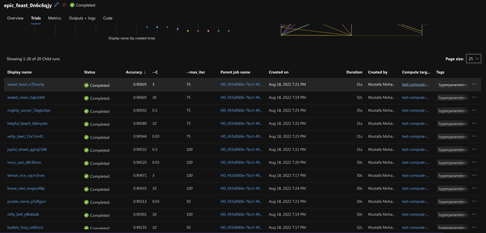
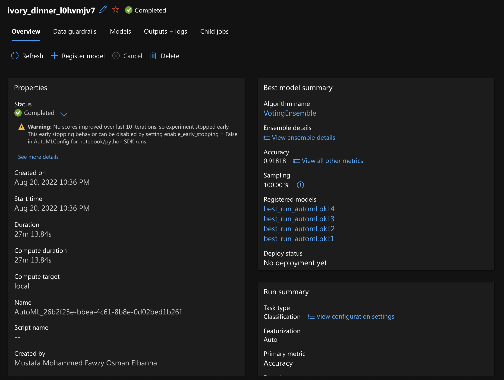
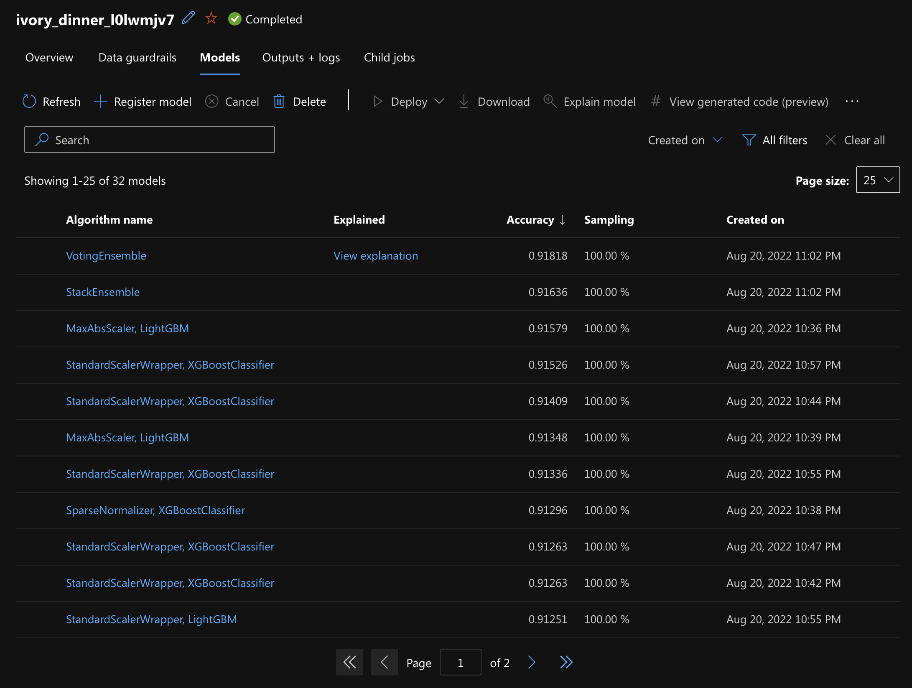
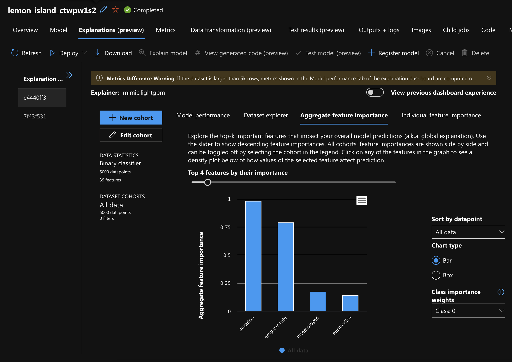
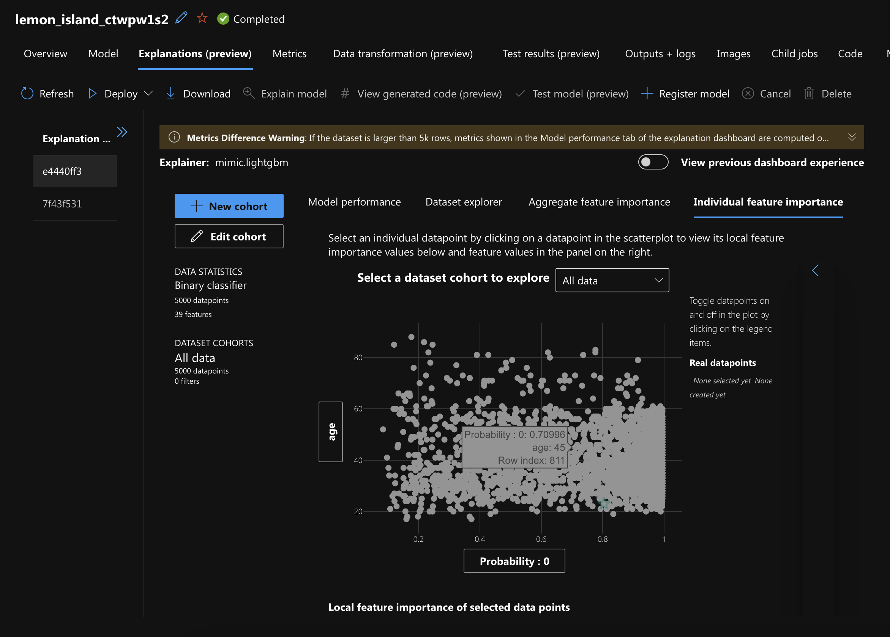
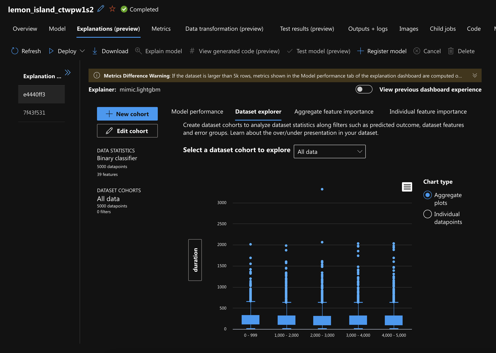
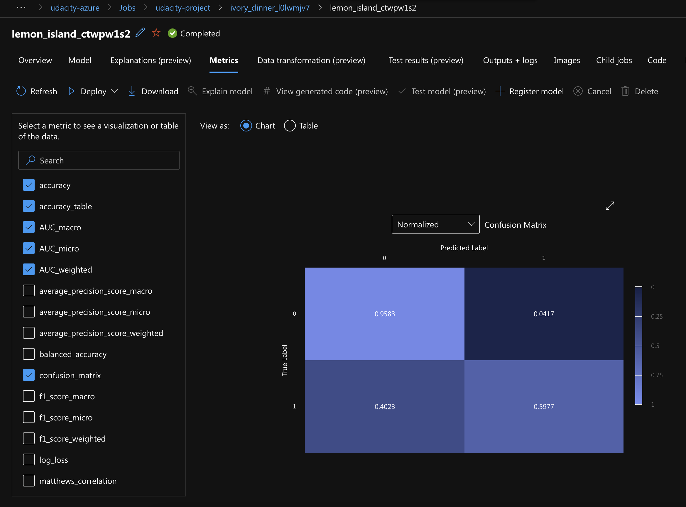

# Optimizing an ML Pipeline in Azure

## Overview
This project is part of the Udacity Azure ML Nanodegree.
In this project, we build and optimize an Azure ML pipeline using the Python SDK and a provided Scikit-learn model.
This model is then compared to an Azure AutoML run.

## Useful Resources
- [ScriptRunConfig Class](https://docs.microsoft.com/en-us/python/api/azureml-core/azureml.core.scriptrunconfig?view=azure-ml-py)
- [Configure and submit training runs](https://docs.microsoft.com/en-us/azure/machine-learning/how-to-set-up-training-targets)
- [HyperDriveConfig Class](https://docs.microsoft.com/en-us/python/api/azureml-train-core/azureml.train.hyperdrive.hyperdriveconfig?view=azure-ml-py)
- [How to tune hyperparamters](https://docs.microsoft.com/en-us/azure/machine-learning/how-to-tune-hyperparameters)

## Summary
**In 1-2 sentences, explain the problem statement: e.g "This dataset contains data about... we seek to predict..."**

We seek to predict if a client will subscribe to a term deposit. All what we have is [UCI Bank Marketing dataset](https://archive.ics.uci.edu/ml/datasets/Bank+Marketing) containing marketing campgains of a banking institution.

**In 1-2 sentences, explain the solution: e.g. "The best performing model was a ..."**

We built a model on that dataset in two forms :
1) Scikit-learn logistic regression with hyperparameters tuning with HyperDrive.

2) AutoML 

We can compare the results of the two methods. The best performing model was obtained through AutoML - VotingEnsemble with accuracy of 0.9158

## Scikit-learn Pipeline
**Explain the pipeline architecture, including data, hyperparameter tuning, and classification algorithm.**

1. Train Script
   1. Import data
   2. Cleaning data:
      * Handling empty values
      * Onehot encoding
      * Preprocessing
   3. Splitting for training and testing
   4. Doing the classification with logistic regression scikit-learn model

2. Create Hyperdrive run by passing ScriptRunConfig, BanditPolicy, RandomParameterSampling and training script itself

3. Save the model

To summarize, Using logistic regression for the classification, and hyperdrive to select the best hyperparameter from the search space.

We can get the best result as seen on the image:



**What are the benefits of the parameter sampler you chose?**

I chose RandomParameterSampling for discrete and continuous hyperparameters with early termination of not well performing runs. It works to increases the accuracy of the model.

**What are the benefits of the early stopping policy you chose?**

BanditPolicy is an early termination policy that terminates low performance runs and improves computational efficiency.
It is based on slackFactor and evaluationInterval and cancels runs where the primary metric is not within the specified slackFactor compared to the best performing run.

## AutoML
**In 1-2 sentences, describe the model and hyperparameters generated by AutoML.**

We made an AutoML configuration like the following:
```python
AutoMLConfig(
    experiment_timeout_minutes=30,
    task='classification',
    primary_metric='accuracy',
    training_data=train_data,
    label_column_name='y',
    n_cross_validations=7
)
```
`VotingEnsemble`was the best model made of 7 voting classifers:

```python
   XGBoostClassifier: 0.125
   LightGBMClassifier: 0.125
   XGBoostClassifier:  0.125
   XGBoostClassifier:  0.125
   SGDClassifierWrapper: 0.125
   LightGBMClassifier: 0.125
   LightGBMClassifier: 0.25
```
AutoML will give accuracy of **91.818%**


## Pipeline comparison

**Compare the two models and their performance. What are the differences in accuracy? In architecture? If there was a difference, why do you think there was one?**

The AutoML produced higher accuracy of **91.818%** and the Sklearn LogicRegression with HyperDrive model produced an accuracy of 90.605% as shown below:





Sklearn LogicRegression with HyperDrive model was like:


It took around 20 iterations for Scikit and 32 iterations for  AutoML. AutoML took Duration of 27m 13.84s and 15m 44.38s.

The difference in accuracy is small.

However, deployment wise, for HyperDrive, a custom code is required. For AutoML, we don't need that.

Model interpretation is available only AutoML and it's useful in understanding why a model made a certain prediction with knowing the importance of features individually.










## Future work

**What are some areas of improvement for future experiments? Why might these improvements help the model?**

Usage of other sampling methods like Gird sampling or Bayesian sampling on the Sklearn model.

For more insights in feature engineering, we can apply model interpretability of AutoML on larger datasets, to optimize model accuracy

## Proof of cluster clean up
**If you did not delete your compute cluster in the code, please complete this section. Otherwise, delete this section.**
**Image of cluster marked for deletion**
